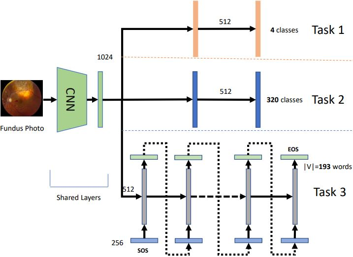

# Multitask Eye Disease Recognition
Multitask learning for eye disease recognition. 

Work done in Microsoft AI Research. 

<b>Architecture Diagram</b>



Run the code with:- 
```
python dataset.py
```


